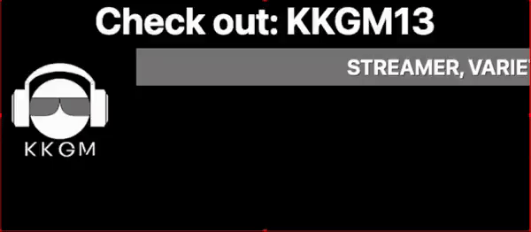

# Updated Personalized Textual Shoutout Overlay for Twitch (PTSO)



**In Rewrite due to [Twitch IRC Deprecation](https://discuss.dev.twitch.tv/t/deprecation-of-chat-commands-through-irc/40486)**

-----
*A Localized and Self-Hosted Twitch Shoutout Overlay system for Twitch Streamers, with personalized streamer-tailored text about a specified streamer via ADMIN section. Overlay trigger is accessible to Twitch Moderators and Channel Streamer only. Using the new Twitch Helix API system.*

## Prerequisites❗
- [NodeJS](https://nodejs.org/en/download) (MacOS use [Homebrew](https://brew.sh)!) & [NodeJS Package Manager](https://npmjs.com)
    - Specifically For ```npm run setup```
- [OBS Studio](https://obsproject.com) (Will work with StreamLabs [BUT Not Recommended])
    - Ensure Twitch Account is connected and linked!
## PTSO Dependencies 🤝
- [Twitch Helix API](https://dev.twitch.tv/docs/api/)
- [VueJS](https://vuejs.org)
<!-- - [Axios-HTTP](http://axios-http.com) -->

## ❗️ First Time Running
### Twitch API Setup
Login to [Twitch Dev](https://dev.twitch.tv) and get your Client ID & Client Secret after creating your own Localhost Application. 

Run ```npm run twitch-setup``` to add your Twitch Credentials in correctly.
### Database Setup
Run ```npm run db``` to create your local database automatically. Do not delete the database called ```streamers.db```.

### Terminals/Command Prompt

### Notes when using 📝
1) ❗️ Please ensure to clear OBS Browser cache **BEFORE & AFTER** streaming for safety, especially for the Admin Page
2) To have unique information for a streamer, start up the localhost server and checkout the Admin page on a browser to add unique statements about them.
    - Required for the SO Overlay to display unique details correctly
## OBS Overlay Setup
🚨Ensure that a localhost system is **running**, otherwise it will not work

Head over to /ptso-twitch/admin on your browser **running** the localhost system and head to the Browser Overlay URL Generator Tab

❗Recommended OBS Browser Dimension Sizes❗
- Width: 800
- Height: 350

## 🛠️ Future Updates to Fix
|Task| Critcality |
|------|-------|
|SO.html: Single Line Carousel during activation| **CRITICAL FEATURE** | 
|⭐️ Admin: Twitch API Integration |✅ Complete|
|⭐️ System: Use Twitch ID instead as a reference system due to potential username changes over time| ✅ Completed|
|📌Admin: Proper Database Calling via DB Manager|✅ SQLite Usage now working|
|Admin/System?: User Customization under request of some Twitch Streamers (eg: Box Color, Font Family, etc...)|Box Color is enabled; other requests to be considered In progress|
|⭐️ System: ExpressJS environment|✅ Complete|