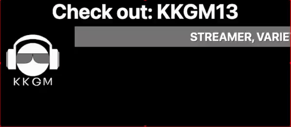

# Updated Personalized Textual Shoutout Overlay for Twitch (PTSO)



**In Rewrite due to [Twitch IRC Deprecation](https://discuss.dev.twitch.tv/t/deprecation-of-chat-commands-through-irc/40486)**

-----
*A Localized and Self-Hosted Twitch Shoutout Overlay system for Twitch Streamers, with personalized streamer-tailored text about a specified streamer via ADMIN section. Overlay trigger is accessible to Twitch Moderators and Channel Streamer only. Using the new Twitch Helix API system.*

## Prerequisites❗
- A LocalHost system running (LAMP/WAMP Stack)
    - A MySQL Database is REQUIRED to be used correctly!
- [NodeJS](https://nodejs.org/en/download) (MacOS use [Homebrew](https://brew.sh)!) & [NodeJS Package Manager](https://npmjs.com)
    - Specifically For ```npm run setup```
- [OBS Studio](https://obsproject.com) (Will work with StreamLabs [BUT Not Recommended])
    - Ensure Twitch Account is connected and linked! 
### Example usage:
- [MAMP](https://www.mamp.info/)
    - If utilizing MAMP, ensure MAMP's Document Root folder calling a folder above this system (eg: DocRootFolder/ptso-twitch/)
- [XAMPP](https://www.apachefriends.org/download.html)
    - If utilizing XAMPP, ensure the ptso-twitch folder is stored in the htdocs folder inside XAMPP.
<!-- - [Express] -->
## PTSO Dependencies 🤝
- [Twitch Helix API](https://dev.twitch.tv/docs/api/)
- [VueJS](https://vuejs.org)
- [Axios-HTTP](http://axios-http.com)

## ❗️ First Time Running
### Twitch API Setup
Login to [Twitch Dev](https://dev.twitch.tv) and get your Client ID & Client Secret after creating your own Localhost Application
### Database Setup
In your respective Localhost system. Create a MySQL database, preferably named `streamers` with the following names:
- `twitchID` as an PRIMARY KEY INT not Autocrementing
- `streamerName` as an TEXT thats NOT NULL
- `streamerDetails` as an TEXT thats NOT NULL
- `streamerColor` as an TEXT thats NOT NULL

### Terminals/Command Prompt
1) Run ```npm update``` on a Command Prompt/Terminal to start up dependencies
    - Must be done to link/update internal dependencies
2) Run the ```npm run setup``` command...
    - *❗️Note: There maybe a scenario that you will need to rerun ```npm run setup``` at different times, to reset correctly.*

### Notes when using 📝
1) ❗️ Please ensure to clear OBS Browser cache **BEFORE & AFTER** streaming for safety, especially for the Admin Page
2) To have unique lines for a streamer, start up the localhost server and checkout the Admin page on a browser to add unique statements about them.
    - Required for the PHP DB File to run correctly 
## OBS Overlay Setup
🚨Ensure that a localhost system is **running**, otherwise it will not work

Head over to /ptso-twitch/admin on your browser **running** the localhost system and head to the Browser Overlay URL Generator Tab

❗Recommended OBS Browser Dimension Sizes❗
- Width: 800
- Height: 350

## 🛠️ Future Updates to Fix
|Task| Critcality |
|------|-------|
|SO.html: Single Line Carousel during activation| **CRITICAL FEATURE** | 
|⭐️ Admin: Twitch API Integration |Complete|
|⭐️ System: Use Twitch ID instead as a reference system due to potential username changes over time|Completed|
|Admin: Automatic Front-end Saving|Pushed to ExpressJS Update|
|📌Admin: Proper Database Calling via MongoDB/MySQL/SQLite|MySQL Integration done \| SQLite Usage in feature/expressJSRewrite|
|Admin/System?: User Customization under request of some Twitch Streamers (eg: Box Color, Font Family, etc...)|In progress|
|⭐️ System: ExpressJS environment|Starting Soon under feature/expressJSRewrite|